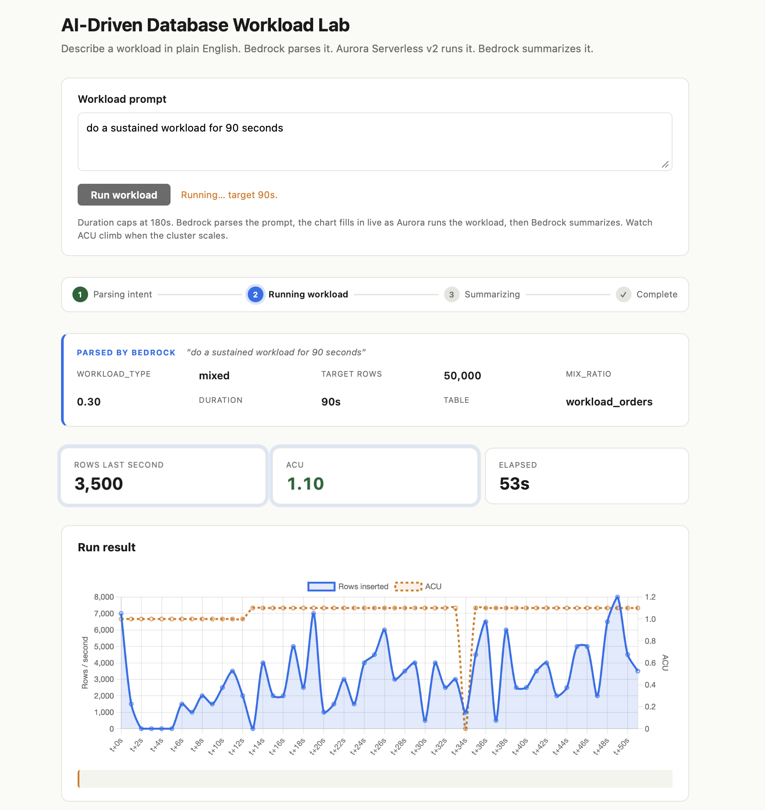
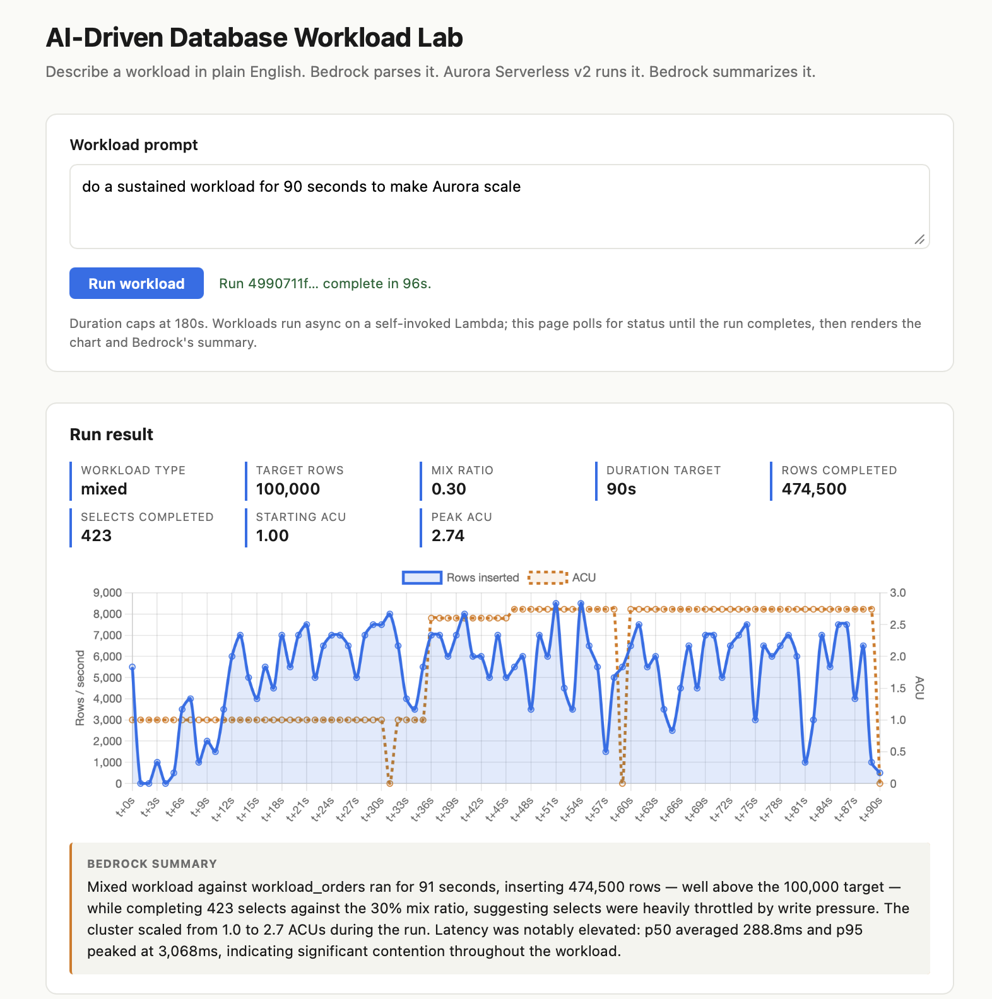
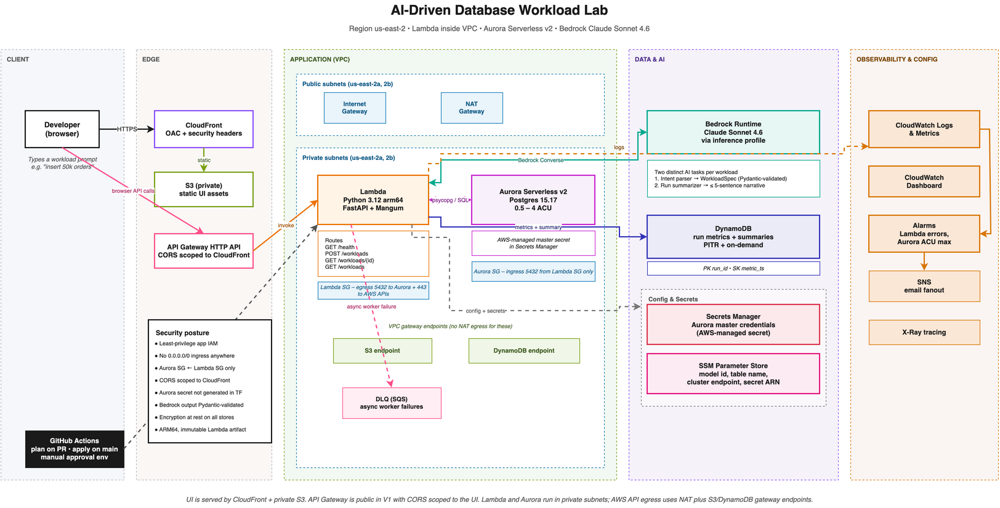

# AI-Driven Database Workload Lab

A platform-engineering self-service tool. A developer types a workload
in plain English in a web UI, and the platform:

1. Sends the prompt to **Bedrock (Claude Sonnet 4.6)**, which translates
   intent into a typed `WorkloadSpec` (rows, table, INSERT/SELECT mix,
   duration).
2. Executes the workload **asynchronously** against an **Aurora Serverless
   v2 Postgres** cluster that auto-scales ACUs under load.
3. Streams per-second metrics (rows/sec, p50/p95 latency, current ACU)
   into **DynamoDB** as the workload runs; the UI polls and renders the
   chart live.
4. Calls Bedrock a second time to write a plain-English summary of what
   actually happened — and is honest about it: "the cluster did not
   scale" when no scaling happened, and a yellow banner explains any
   user-input clamping (ADR-011).

## Live demo

**🌐 https://d333zl5hz71w0e.cloudfront.net**

Try one of these prompts:

- `"do a million inserts and let aurora scale"` — pushes Aurora hard
  enough to scale 0.5 → 3+ ACU; takes ~3 minutes; the chart fills in
  live as the cluster ramps up.
- `"do a million inserts in 5 seconds"` — the **honest-clamp**
  showcase: Bedrock surfaces a yellow banner explaining that
  ~3,000 inserts/sec is the realistic ceiling and clamps to 15,000
  rows; the summary opens by acknowledging the gap.
- `"insert 30,000 rows in 60 seconds"` — a normal achievable run; no
  banner, full chart, mid-range ACU.





## Demo highlights

- **Live Aurora ACU scaling.** Seen in the chart as it fills in;
  measured runs have driven 0.5 → 3.0 ACU within a single 177-second
  window ([cluster ACU detail](docs/screenshots/aurora-cluster-acu.png)).
  Bedrock's summary narrates the scaling honestly — including when no
  scaling happened (ADR-008).
- **Honest-clamp pattern.** The platform never silently mutates user
  input. When Bedrock has to clamp an unrealistic ask (a million rows
  in 5 seconds), a yellow banner surfaces the user's verbatim prompt
  and Bedrock's reasoning, and the summary's first sentence
  acknowledges the gap (ADR-011).
- **Async self-invoke for >30s workloads.** API Gateway HTTP API caps
  integration at 30 seconds. The platform parses intent synchronously,
  then `lambda.invoke(InvocationType="Event")` to itself with a
  sentinel payload — same code, same image, same env vars. Workloads
  now run up to 180s; the UI polls until terminal status (ADR-012).
- **Real SNS alarm validated by real traffic.** Aurora hit the 4.0 ACU
  ceiling during testing; an
  [`aurora-acu-at-max` ALARM email](docs/screenshots/sns-alarm-fired.png)
  arrived, and an
  [OK email](docs/screenshots/sns-alarm-recovered.png) followed when the
  cluster returned to baseline. The
  [alarm history](docs/screenshots/alarm-history.png) shows the round-trip
  on the dashboard
  ([dashboard overview](docs/screenshots/cloudwatch-dashboard.png),
  [Bedrock + clamp metrics](docs/screenshots/cloudwatch-dashboard-2.png)).
  End-to-end observability — not a paper exercise.

---

## Why this exists

The same prompt + summary pattern shows up in many places (intent
parser, run summary). What's interesting is the rest of the platform
around it:

- **Aurora Serverless v2** is the centerpiece. The demo's headline is
  watching ACUs rise under load and fall back down again.
- **Two Bedrock roles, one model**, clearly separated:
  intent-parsing (prompt → typed spec) and result-summarization
  (metrics → human-readable summary).
- **DynamoDB for metrics**, not Postgres. Per-second writes during a
  workload should not compete with the workload itself for Aurora
  capacity. DynamoDB on-demand absorbs them cleanly.
- **Lambda inside a VPC**, talking to Aurora over a private security
  group on 5432 — closer to real production posture than the RDS Data
  API shortcut.
- **CloudFront + S3** for the UI, with Origin Access Control + a private
  bucket.

The output is also a **reference architecture** for the platform team:
VPC, IAM least-privilege, Bedrock-with-validation, observability,
Terraform modules.

---

## Architecture



```
Browser
  └─> CloudFront ─> S3 (private, OAC)            static UI
        UI calls API
  └─> API Gateway HTTP API                       CORS scoped to CloudFront
        └─> Lambda (Python 3.12 / arm64, in VPC private subnets)
              ├─> SSM Parameter Store           model id, cluster id, table name
              ├─> Secrets Manager               AWS-managed Aurora master secret
              ├─> Bedrock Runtime               Converse — intent parser + summary
              ├─> Aurora Serverless v2 Postgres writer endpoint via psycopg
              └─> DynamoDB                      run header + per-second metrics

VPC: 10.20.0.0/16, 2 AZs, 2 public + 2 private subnets, single NAT.
SGs:   Lambda → Aurora 5432 only; Lambda → 0.0.0.0/0 443 only (NAT).
       Aurora ingress 5432 from Lambda SG only. No 0.0.0.0/0 ingress.
Gateway endpoints: S3 + DynamoDB (free; off the NAT path).
```

[`DECISIONS.md`](DECISIONS.md) records every non-obvious choice with
reasoning and v1.5 migration paths.

---

## Stack

| Layer        | Technology                                                                  |
| ------------ | --------------------------------------------------------------------------- |
| UI           | Static HTML + vanilla JS + Chart.js, served by CloudFront                   |
| API          | API Gateway HTTP API ($default route → Lambda)                              |
| Service      | Python 3.12 / FastAPI / Pydantic v2 / Mangum, on Lambda arm64               |
| Workload     | psycopg 3 + psycopg_pool (4–6 conns), 4 worker threads, 500-row executemany |
| AI           | Bedrock Converse, Claude Sonnet 4.6 via inference profile (us.\*)           |
| Database     | Aurora Serverless v2 Postgres 15.17, [AWS-managed master credentials](docs/screenshots/aurora-secret-managed.png) (ADR-007) |
| Metrics      | DynamoDB on-demand, sparse GSI on status                                    |
| Config       | SSM Parameter Store + Secrets Manager (no secrets in TF state)              |
| Observability| CloudWatch alarms + dashboard, SNS email, X-Ray, structlog JSON             |
| Infra        | Terraform 1.9+ / AWS provider 5.100.0, local state                          |
| CI           | GitHub Actions (ruff, pytest, fmt + validate, plan on PR, apply on main)    |

---

## Repository layout

```
.
├── CLAUDE.md                     project conventions and rules
├── DECISIONS.md                  ADRs: every non-obvious choice + v1.5 path
├── README.md                     this file
├── diagrams/                     architecture diagram source + PNG
├── app/
│   ├── pyproject.toml            Python deps, ruff + pytest config
│   ├── src/ngx_workload_lab/     service code
│   │   ├── main.py               FastAPI routes + Mangum handler
│   │   ├── bedrock.py            Converse: parse_intent + summarize_run
│   │   ├── workload.py           pool, executor, ACU sampling
│   │   ├── storage.py            DynamoDB persistence
│   │   ├── config.py             cold-start env loader
│   │   ├── models.py             Pydantic schemas + table allowlist
│   │   ├── logging_setup.py      structlog JSON config
│   │   └── prompts/              .md system prompts
│   ├── tests/                    pytest unit tests (16)
│   ├── ui/                       index.html / styles.css / index.js
│   └── scripts/
│       ├── build_lambda_package.sh   manylinux2014_aarch64 zip build
│       └── deploy_ui.sh              S3 sync + CloudFront invalidation
├── infra/
│   ├── envs/dev/                 environment composition + SSM params
│   └── modules/
│       ├── vpc/                  2 AZ + NAT + gateway endpoints
│       ├── aurora/               Serverless v2 Postgres
│       ├── lambda_api/           Lambda + HTTP API + IAM least-privilege
│       ├── dynamodb/             runs table + GSI
│       ├── static_site/          S3 + CloudFront + OAC
│       └── observability/        SNS + alarms + dashboard
└── .github/workflows/            CI + deploy-dev pipelines
```

---

## Deploy from scratch

> **v1 deploys locally.** CI runs lint, test, and `terraform validate`
> on every PR. **Production deploy via GitHub Actions is intentionally
> deferred to v1.5 with OIDC role assumption** — see [ADR-010](DECISIONS.md).
> No long-lived AWS keys live in GitHub Secrets, by design. The
> `deploy-dev.yml` workflow stays in tree as a `workflow_dispatch`
> placeholder that builds the Lambda zip and runs `terraform validate`
> without AWS credentials, so the v1.5 cutover is a workflow-only edit.

### Prerequisites

- AWS account with **Pay-As-You-Go** billing (Aurora cluster creation
  is blocked on the AWS Free Plan; see DECISIONS ADR-003).
- AWS region `us-east-2` with Bedrock Claude Sonnet 4.6 inference
  profile access enabled in the console.
- `terraform >= 1.9`, `python 3.12`, `uv`, `aws` CLI configured with
  credentials.

### 1. Build the Lambda zip

```bash
uv venv --python 3.12 app/.venv
uv pip install --python app/.venv/bin/python -e "app[dev]"
app/.venv/bin/python -m ensurepip --upgrade
bash app/scripts/build_lambda_package.sh
# → app/build/lambda.zip (verifies arm64 only)
```

### 2. Apply infrastructure

```bash
cd infra/envs/dev
terraform init
terraform apply -var=alarm_email=you@example.com
# Approves and creates ~50 resources. Aurora cluster takes ~5 min.
# Watch your inbox for the SNS subscription confirmation.
```

Outputs include `api_endpoint`, `ui_url`, `dashboard_url`,
`alerts_sns_topic_arn`.

### 3. Deploy the UI

```bash
bash app/scripts/deploy_ui.sh dev
# Substitutes the API URL into config.js, syncs to S3, invalidates CloudFront.
```

### 4. Try it

- Visit `ui_url` from the Terraform outputs.
- Type a prompt: **"do a quick mixed workload for 10 seconds"**.
- Watch the chart render once Bedrock summarizes (sync request, ~12 s).

Or via curl:

```bash
curl -X POST "$API_URL/workloads" \
  -H 'content-type: application/json' \
  -d '{"prompt":"do a quick mixed workload for 10 seconds"}'
```

### 5. Iterate

- Edit `app/src/ngx_workload_lab/`, run `pytest` and `ruff check`.
- Rebuild the zip: `bash app/scripts/build_lambda_package.sh`.
- Re-apply: `terraform apply -var=alarm_email=...` (Lambda updates
  in-place via the new `source_code_hash`).
- For UI changes: `bash app/scripts/deploy_ui.sh dev`.

---

## Teardown

```bash
cd infra/envs/dev
terraform destroy -var=alarm_email=you@example.com
```

Notes:

- Empty the UI S3 bucket first if versioning has any objects in non-current versions: `aws s3 rm s3://<bucket> --recursive` and delete versions via the console (the bucket has versioning on per the static_site module).
- The Aurora master secret has a 7-day recovery window after `terraform destroy`. The legacy custom secret created by ADR-007's phase-1 transition has been removed already.
- `terraform destroy` does **not** remove SNS subscription confirmations — that's an inbox-side click.

---

## Known limitations (v1)

Honest list of where the demo's seams show. The same kind of detail
is in the relevant ADRs.

- **CloudWatch ACU metric is published at 1-minute granularity**
  (ADR-008). Within a 60-second workload, the per-second ACU samples
  on the chart are often the same value because no new datapoint has
  been published yet. Longer runs (90–180s) reveal the actual scaling
  curve. A "scaled live" run on the chart looks like a few step
  changes, not a smooth ramp — that's CloudWatch, not Aurora.
- **`row_count` is a target, not a guarantee** (ADR-008). The executor
  honors `duration_seconds` as the hard cap; row_count is best-effort.
  Honest-clamping (ADR-011) clamps unrealistic asks at parse time so
  Bedrock's summary can acknowledge the gap.
- **Lambda async invocation retries on failure by default.** The
  worker writes a `workload_error` RunRecord on caught exceptions, but
  an uncaught crash could land twice in the table. v1 accepts this;
  v1.5 sets `MaximumRetryAttempts: 0` on the function's async config.
- **Single NAT, single writer Aurora, single AZ for the writer.** v1
  cost-saver. v1.5 adds HA NAT, reader replicas, and multi-AZ.
- **Local Terraform state** (ADR-002). v1.5 migrates to S3 + DynamoDB
  lock + GitHub OIDC.
- **Static AWS keys for CI deploys** (ADR-010). v1.5 swaps to GitHub
  OIDC with a least-privilege role.

## What's next (v1.5)

Documented in `DECISIONS.md` under "v1.5 migration path" sections:

| ADR | Decision                                                | v1.5 migration                                                            |
| --- | ------------------------------------------------------- | ------------------------------------------------------------------------- |
| 002 | Local Terraform state                                   | S3 backend + DynamoDB lock + GitHub OIDC role                             |
| 003 | Operate as account root                                 | Named IAM user + MFA + OIDC role for CI                                   |
| 005 | Gateway VPC endpoints only                              | Add interface endpoints (SSM, Secrets Manager, Bedrock Runtime)           |
| 008 | row_count is target, duration is hard cap (5..20 in v1) | Step Functions / SQS for async workloads → 5..3600s                       |
| 009 | Synchronous request path capped by API GW 30s          | Async kickoff returning 202 + run_id; UI polls /workloads/{run_id}        |

Other v1.5 items not yet ADR'd:

- Customer-managed KMS keys on Aurora storage, Secrets Manager, DDB, S3.
- IAM auth for Postgres, per-team DB users.
- Multi-AZ writer + reader replicas.
- Multi-environment (`staging`, `prod`).
- Terraform tests (`.tftest.hcl`).
- Cognito or signed CloudFront URLs in front of the UI.

---

## License

Proprietary. Internal lab project.
