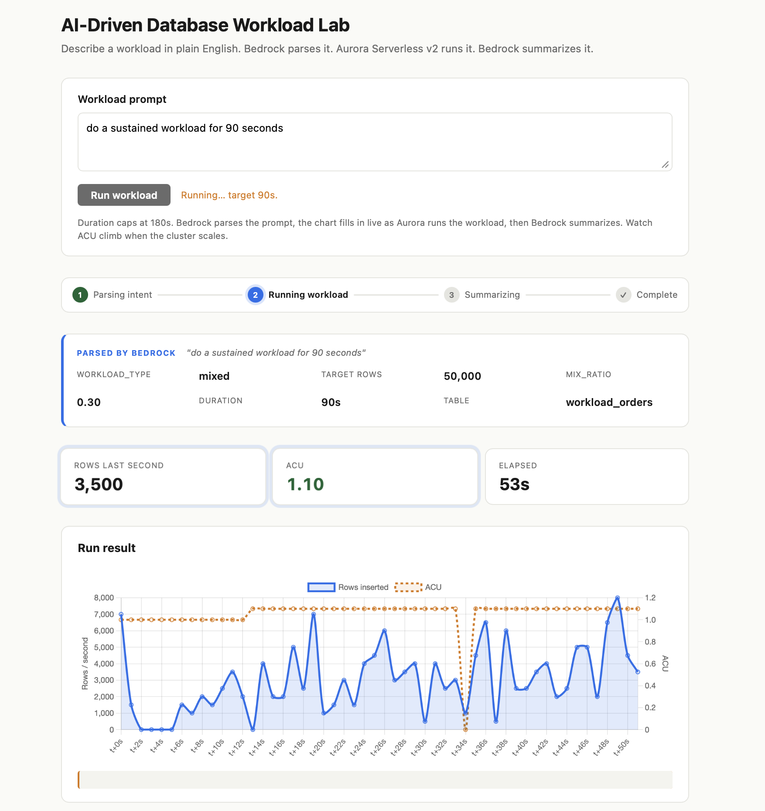
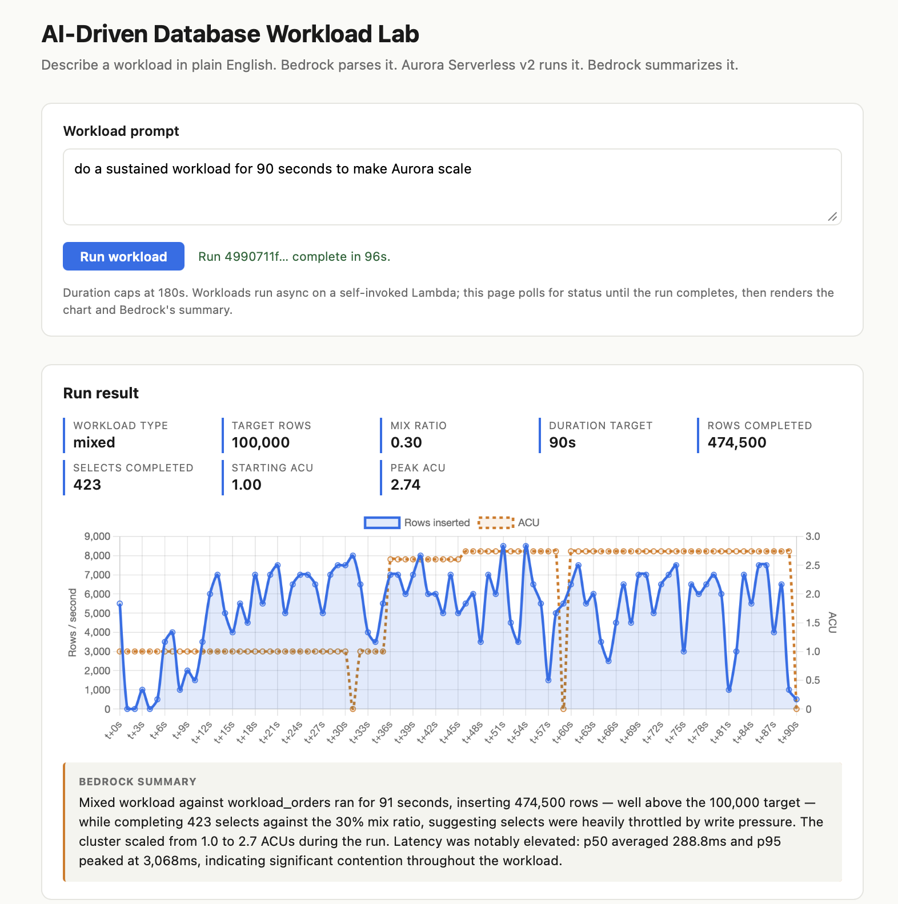
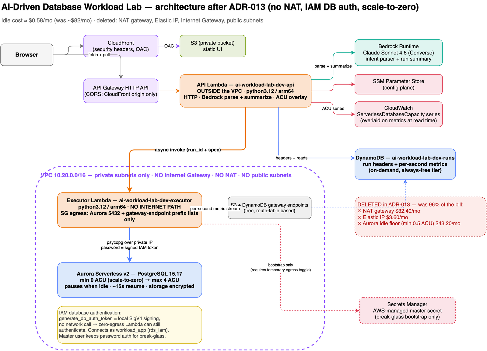
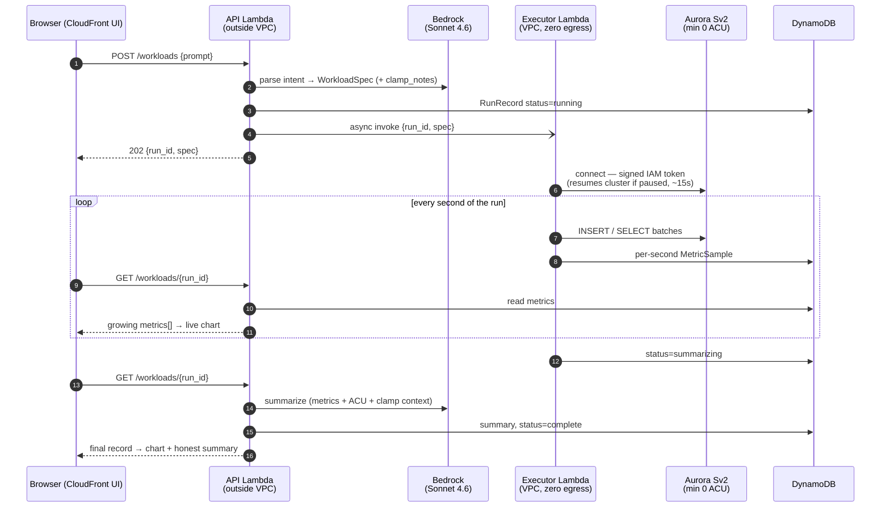
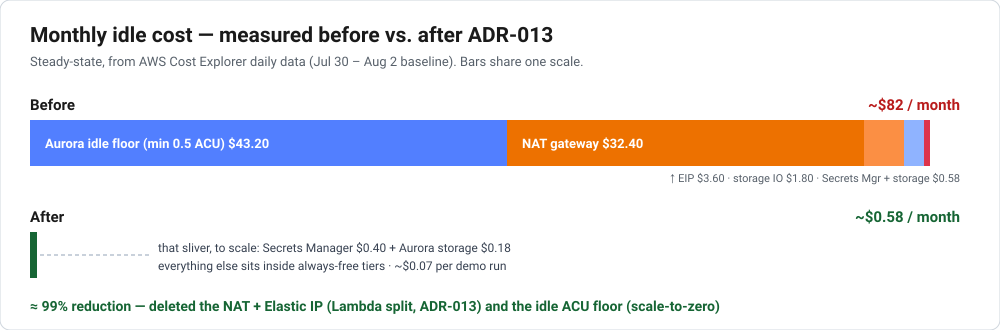

# AI-Driven Database Workload Lab

A platform-engineering self-service tool. A developer types a workload
in plain English in a web UI, and the platform:

1. Sends the prompt to **Bedrock (Claude Sonnet 4.6)**, which translates
   intent into a typed `WorkloadSpec` (rows, table, INSERT/SELECT mix,
   duration).
2. Executes the workload **asynchronously** against an **Aurora Serverless
   v2 Postgres** cluster that auto-scales ACUs under load.
3. Streams per-second metrics (rows/sec, p50/p95 latency) into
   **DynamoDB** as the workload runs; the API overlays the CloudWatch
   ACU series at read time, and the UI polls and renders the chart live.
4. Calls Bedrock a second time to write a plain-English summary of what
   actually happened — and is honest about it: "the cluster did not
   scale" when no scaling happened, and a yellow banner explains any
   user-input *clamping* (ADR-011).

> **Clamp** *(verb)*: when the platform adjusts a number you stated to
> fit a real constraint — e.g., asking for "1,000,000 rows in 5 seconds"
> gets clamped to 15,000 rows, because a single Lambda over psycopg
> tops out near 3,000 inserts/sec. The platform never clamps silently:
> Bedrock writes a one-sentence explanation, the UI shows a yellow
> banner, and the run summary's first sentence acknowledges the gap.

## Live demo

**🌐 https://d333zl5hz71w0e.cloudfront.net**

Try one of these prompts:

- **`"insert 30,000 rows in 15 seconds"`** — a clean, fast run. Bedrock parses the prompt, the workload runs against Aurora, and the chart fills in live as it goes. Good first try to see the full pipeline end-to-end.

- **`"do a sustained workload for 90 seconds"`** — the **scaling demo**: Aurora visibly scales 1.0 → 2.7+ ACU live in the chart as the cluster ramps up to handle the sustained pressure. The headline run.

- **`"do a million inserts in 5 seconds"`** — the **honest-feedback** showcase (ADR-011): the ask is unrealistic (1M rows / 5s = 200k inserts/sec, well above what one Lambda can do), so Bedrock caps the request to a realistic target and surfaces a yellow banner explaining what was changed and why. The run still completes successfully at the capped target; Bedrock's summary opens by acknowledging the gap. The platform never silently changes user input — it tells you what it did.

> **Tip:** the first run after the lab has been idle waits ~15 seconds
> while Aurora resumes from 0 ACU (scale-to-zero, ADR-013). The phase
> stepper sits in "Running workload…" while it wakes — that pause *is*
> the cost optimization working.





## Demo highlights

- **Live Aurora ACU scaling.** Seen in the chart as it fills in;
  validation runs drove 0.5 → 3.0 ACU within a single 177-second window
  ([cluster ACU detail](docs/screenshots/aurora-cluster-acu.png), July —
  the floor is 0 ACU now, so today's runs climb from a cold start).
  Bedrock's summary narrates the scaling honestly — including when no
  scaling happened (ADR-008).
- **Honest-clamp pattern.** The platform never silently mutates user
  input. When Bedrock has to clamp an unrealistic ask (a million rows
  in 5 seconds), a yellow banner surfaces the user's verbatim prompt
  and Bedrock's reasoning, and the summary's first sentence
  acknowledges the gap (ADR-011).
- **A zero-egress executor with IAM database auth.** Workloads run on
  a dedicated Lambda inside the VPC with **no internet path at all** —
  no NAT, no IGW, no interface endpoints. It authenticates to Postgres
  with a locally-signed IAM token (`generate_db_auth_token` makes no
  network call) and streams metrics over a free DynamoDB gateway
  endpoint. Workloads run up to 180s; the UI polls until terminal
  status (ADR-013).
- **A 99% cost reduction driven by reading the bill.** The first
  month's invoice showed 96% of spend was idle infrastructure. The
  Lambda split + scale-to-zero refactor took idle cost from ~$82/mo to
  ~$0.58/mo without giving up the always-on demo URL — full receipts
  in the [Cost](#cost) section and ADR-013.
- **Real SNS alarm validated by real traffic.** Aurora hit the 4.0 ACU
  ceiling during testing; an
  [`aurora-acu-at-max` ALARM email](docs/screenshots/sns-alarm-fired.png)
  arrived, and an
  [OK email](docs/screenshots/sns-alarm-recovered.png) followed when the
  cluster returned to baseline. The
  [alarm history](docs/screenshots/alarm-history.png) shows the round-trip
  on the dashboard
  ([dashboard overview](docs/screenshots/cloudwatch-dashboard.png),
  [Bedrock + clamp metrics](docs/screenshots/cloudwatch-dashboard-2.png)).
  End-to-end observability — not a paper exercise.

---

## Why this exists

The same prompt + summary pattern shows up in many places (intent
parser, run summary). What's interesting is the rest of the platform
around it:

- **Aurora Serverless v2** is the centerpiece. The demo's headline is
  watching ACUs rise under load and fall back down again.
- **Two Bedrock roles, one model**, clearly separated:
  intent-parsing (prompt → typed spec) and result-summarization
  (metrics → human-readable summary).
- **DynamoDB for metrics**, not Postgres. Per-second writes during a
  workload should not compete with the workload itself for Aurora
  capacity. DynamoDB on-demand absorbs them cleanly.
- **Two Lambdas split by network requirement** (ADR-013). The executor
  lives inside the VPC and reaches Aurora over a private security
  group on 5432; everything needing public AWS APIs runs outside it.
  Aurora ends up unreachable from the internet *by construction* — the
  VPC has no IGW — not merely by security-group policy.
- **CloudFront + S3** for the UI, with Origin Access Control + a private
  bucket.

The output is also a **reference architecture** for the platform team:
VPC, IAM least-privilege, Bedrock-with-validation, observability,
Terraform modules.

---

## Architecture



Source: [diagrams/architecture.drawio](diagrams/architecture.drawio) — open in app.diagrams.net or VS Code with the Draw.io Integration extension. Two pages: the detailed AWS view above and a simple product-flow view. The PNG is exported from it via the draw.io CLI.

```
Browser
  └─> CloudFront ─> S3 (private, OAC)            static UI
        UI calls API
  └─> API Gateway HTTP API                       CORS scoped to CloudFront
        └─> API Lambda  ── OUTSIDE the VPC ──    python3.12 / arm64
              ├─> SSM Parameter Store            model id, cluster id, table name
              ├─> Bedrock Runtime                Converse — intent parser + summary
              ├─> CloudWatch                     ServerlessDatabaseCapacity series
              ├─> DynamoDB                       run header + metric rows
              └─> async invoke ▼
                    Executor Lambda ── INSIDE the VPC, NO INTERNET ──
                      ├─> Aurora Serverless v2   private IP, IAM auth token
                      └─> DynamoDB               free gateway endpoint

VPC: 10.20.0.0/16, 2 AZs, private subnets only.
     No IGW. No NAT. No public subnets. Aurora is unreachable from the
     internet by construction, not by policy.
SGs: executor → Aurora 5432 only (no egress to 0.0.0.0/0 at all).
     Aurora ← 5432 from the executor SG only.
Gateway endpoints: S3 + DynamoDB (free, route-table based).
```

### Run lifecycle

The "Summarizing" step in the UI is real work, not a spinner: the
executor cannot reach Bedrock, so the API Lambda writes the summary on
the poll after the workload finishes.


```mermaid
sequenceDiagram
    autonumber
    participant UI as Browser (CloudFront UI)
    participant API as API Lambda<br/>(outside VPC)
    participant BR as Bedrock<br/>(Sonnet 4.6)
    participant EX as Executor Lambda<br/>(VPC, zero egress)
    participant AU as Aurora Sv2<br/>(min 0 ACU)
    participant DDB as DynamoDB

    UI->>API: POST /workloads {prompt}
    API->>BR: parse intent → WorkloadSpec (+ clamp_notes)
    API->>DDB: RunRecord status=running
    API-)EX: async invoke {run_id, spec}
    API-->>UI: 202 {run_id, spec}
    EX->>AU: connect — signed IAM token<br/>(resumes cluster if paused, ~15s)
    loop every second of the run
        EX->>AU: INSERT / SELECT batches
        EX->>DDB: per-second MetricSample
        UI->>API: GET /workloads/{run_id}
        API->>DDB: read metrics
        API-->>UI: growing metrics[] → live chart
    end
    EX->>DDB: status=summarizing
    UI->>API: GET /workloads/{run_id}
    API->>BR: summarize (metrics + ACU + clamp context)
    API->>DDB: summary, status=complete
    API-->>UI: final record → chart + honest summary
```

[`DECISIONS.md`](DECISIONS.md) records every non-obvious choice with
reasoning and v1.5 migration paths.

---

## Stack

| Layer        | Technology                                                                  |
| ------------ | --------------------------------------------------------------------------- |
| UI           | Static HTML + vanilla JS + Chart.js, served by CloudFront                   |
| API          | API Gateway HTTP API ($default route → Lambda)                              |
| Service      | Python 3.12 / FastAPI / Pydantic v2 / Mangum, on Lambda arm64 (2 functions) |
| Workload     | psycopg 3 + psycopg_pool (4–6 conns), 4 worker threads, 500-row executemany |
| DB auth      | IAM database authentication — locally-signed token, no password at runtime  |
| AI           | Bedrock Converse, Claude Sonnet 4.6 via inference profile (us.\*)           |
| Database     | Aurora Serverless v2 Postgres 15.17, [AWS-managed master credentials](docs/screenshots/aurora-secret-managed.png) (ADR-007) |
| Metrics      | DynamoDB on-demand, sparse GSI on status                                    |
| Config       | SSM Parameter Store + Secrets Manager (no secrets in TF state)              |
| Observability| CloudWatch alarms + dashboard, SNS email, X-Ray, structlog JSON             |
| Infra        | Terraform 1.9+ / AWS provider 5.100.0, local state                          |
| CI           | GitHub Actions (ruff, pytest, fmt + validate, checkov) — deploys are local by design (ADR-010) |

---

## Repository layout

```
.
├── CLAUDE.md                     project conventions and rules
├── DECISIONS.md                  ADRs: every non-obvious choice + v1.5 path
├── README.md                     this file
├── diagrams/                     drawio source + PNG export + cost chart SVG
├── app/
│   ├── pyproject.toml            Python deps, ruff + pytest config
│   ├── src/ngx_workload_lab/     service code
│   │   ├── main.py               API Lambda: FastAPI routes, summary finalize
│   │   ├── executor.py           executor Lambda: runs the workload (in VPC)
│   │   ├── bedrock.py            Converse: parse_intent + summarize_run
│   │   ├── workload.py           psycopg pool + IAM-token DSN + load loops
│   │   ├── acu.py                CloudWatch ACU series overlay (read time)
│   │   ├── bootstrap.py          one-time rds_iam grant (break-glass)
│   │   ├── storage.py            DynamoDB persistence
│   │   ├── config.py             cold-start env loader
│   │   ├── models.py             Pydantic schemas + table allowlist
│   │   ├── logging_setup.py      structlog JSON config
│   │   └── prompts/              .md system prompts
│   ├── tests/                    pytest unit tests (16)
│   ├── ui/                       index.html / styles.css / index.js
│   └── scripts/
│       ├── build_lambda_package.sh   manylinux2014_aarch64 zip build
│       └── deploy_ui.sh              S3 sync + CloudFront invalidation
├── infra/
│   ├── envs/dev/                 environment composition + SSM params
│   └── modules/
│       ├── vpc/                  2-AZ private subnets + gateway endpoints
│       │                         (internet egress behind a default-off toggle)
│       ├── aurora/               Serverless v2 Postgres
│       ├── lambda_api/           Lambda + HTTP API + IAM least-privilege
│       ├── dynamodb/             runs table + GSI
│       ├── static_site/          S3 + CloudFront + OAC
│       └── observability/        SNS + alarms + dashboard
└── .github/workflows/            CI + deploy-dev pipelines
```

---

## Deploy from scratch

> **v1 deploys locally.** CI runs lint, test, and `terraform validate`
> on every PR. **Production deploy via GitHub Actions is intentionally
> deferred to v1.5 with OIDC role assumption** — see [ADR-010](DECISIONS.md).
> No long-lived AWS keys live in GitHub Secrets, by design. The
> `deploy-dev.yml` workflow stays in tree as a `workflow_dispatch`
> placeholder that builds the Lambda zip and runs `terraform validate`
> without AWS credentials, so the v1.5 cutover is a workflow-only edit.

### Prerequisites

- AWS account with **Pay-As-You-Go** billing (Aurora cluster creation
  is blocked on the AWS Free Plan; see DECISIONS ADR-003).
- AWS region `us-east-2` with Bedrock Claude Sonnet 4.6 inference
  profile access enabled in the console.
- `terraform >= 1.9`, `python 3.12`, `uv`, `aws` CLI configured with
  credentials.

### 1. Build the Lambda zip

```bash
uv venv --python 3.12 app/.venv
uv pip install --python app/.venv/bin/python -e "app[dev]"
app/.venv/bin/python -m ensurepip --upgrade
bash app/scripts/build_lambda_package.sh
# → app/build/lambda.zip (verifies arm64 only)
```

### 2. Apply infrastructure

```bash
cd infra/envs/dev
terraform init
terraform apply -var=alarm_email=you@example.com
# Approves and creates ~50 resources. Aurora cluster takes ~5 min.
# Watch your inbox for the SNS subscription confirmation.
```

Outputs include `api_endpoint`, `ui_url`, `dashboard_url`,
`alerts_sns_topic_arn`.

### 3. One-time IAM database auth bootstrap

The executor authenticates as the `workload_app` Postgres role, which
must be created once — and creating it needs the master password from
Secrets Manager, which the zero-egress executor normally cannot reach.
So a fresh deploy briefly opens egress:

```bash
# in infra/envs/dev
terraform apply -var=alarm_email=you@example.com -var='enable_internet_egress=true'   # temporary NAT (~$0.05/hr)
aws lambda invoke --function-name ai-workload-lab-dev-executor \
  --cli-binary-format raw-in-base64-out \
  --payload '{"_ngx_bootstrap": true}' /tmp/bootstrap.json
cat /tmp/bootstrap.json   # expect: grants_applied + iam_auth_verified true
terraform apply -var=alarm_email=you@example.com                                      # egress off again
```

Ten minutes of NAT is a few cents; the toggle exists exactly for this
(ADR-013 "break-glass").

### 4. Deploy the UI

```bash
bash app/scripts/deploy_ui.sh dev
# Substitutes the API URL into config.js, syncs to S3, invalidates CloudFront.
```

### 5. Try it

- Visit `ui_url` from the Terraform outputs.
- Type a prompt: **"insert 30,000 rows in 15 seconds"**.
- The chart fills in live as the executor streams per-second metrics;
  Bedrock's summary lands when the stepper reaches "Complete". First
  run after idle waits ~15s while Aurora resumes from zero.

Or via curl:

```bash
curl -X POST "$API_URL/workloads" \
  -H 'content-type: application/json' \
  -d '{"prompt":"do a quick mixed workload for 10 seconds"}'
```

### 6. Iterate

- Edit `app/src/ngx_workload_lab/`, run `pytest` and `ruff check`.
- Rebuild the zip: `bash app/scripts/build_lambda_package.sh`.
- Re-apply: `terraform apply -var=alarm_email=...` (Lambda updates
  in-place via the new `source_code_hash`).
- For UI changes: `bash app/scripts/deploy_ui.sh dev`.

---

## Teardown

```bash
cd infra/envs/dev
terraform destroy -var=alarm_email=you@example.com
```

Notes:

- Empty the UI S3 bucket first if versioning has any objects in non-current versions: `aws s3 rm s3://<bucket> --recursive` and delete versions via the console (the bucket has versioning on per the static_site module).
- The Aurora master secret has a 7-day recovery window after `terraform destroy`. The legacy custom secret created by ADR-007's phase-1 transition has been removed already.
- `terraform destroy` does **not** remove SNS subscription confirmations — that's an inbox-side click.

---

## Cost

The first real bill was **$69.02**, and reading it changed the architecture.

| Usage type | Cost | What it actually was |
| --- | ---: | --- |
| NAT Gateway hours | $36.22 | the gateway existing, 805 hrs |
| Aurora ACU-hours | $26.10 | 402.58 ACU-hr over 805 hrs = a flat **0.50 average** — the floor |
| Public IPv4 address | $4.03 | the Elastic IP on the NAT |
| Aurora storage IO | $2.03 | ← every demo run ever executed |
| Secrets Manager + storage | $0.64 | |

**96% was infrastructure sitting idle.** Every demo run ever executed
totalled about two dollars of storage IO. (That table is July's partial
month; the measured *steady state* before the refactor was **$2.72/day
≈ $82/mo**.)

The refactor in [ADR-013](DECISIONS.md) splits the Lambda in two so the half
that needs the internet can live outside the VPC — which makes the NAT gateway
unnecessary — and sets Aurora `min_capacity = 0` so an idle cluster bills
nothing for compute.



| | before (measured) | after |
| --- | ---: | ---: |
| Idle | ~$82/mo | **~$0.58/mo** |
| Per demo run | — | ~$0.07 |

The remaining $0.58 is Secrets Manager ($0.40, required by the cluster's
managed master credentials) and Aurora storage ($0.18 for 2 GB of
`workload_orders`). `terraform destroy` takes it to $0.

## Known limitations (v1)

Honest list of where the demo's seams show. The same kind of detail
is in the relevant ADRs.

- **CloudWatch ACU metric is published at 1-minute granularity**
  (ADR-008). Longer runs (90–180s) reveal the actual scaling curve; a
  "scaled live" chart shows a few step changes rather than a smooth
  ramp. That's CloudWatch's publish cadence, not Aurora's behaviour.
  The API Lambda fetches the real series and maps each metric row to
  its nearest datapoint rather than pretending to per-second
  resolution (ADR-013).
- **Aurora scale-to-zero costs a cold start.** With `min_capacity = 0`
  an idle cluster pauses; the first query after a pause waits ~15s for
  resume. Warm it before a live demo.
- **The account's Lambda concurrency limit is 10**, not the usual 1000
  — new AWS accounts are throttled until the limit is raised. Two
  functions sharing a 10-execution pool is fine for one user and is
  the first thing that breaks under real traffic.
- **The executor Lambda has no dead-letter queue.** SQS has no gateway
  endpoint, so a DLQ would reintroduce the internet dependency the
  refactor removed. Errors surface as a `workload_error` RunRecord,
  which the UI renders; catastrophic failures appear in CloudWatch
  Logs but are not queued for replay (ADR-013).
- **Alarms and dashboard watch the API Lambda only.** The executor has
  a log group but no error alarm or dashboard widget yet — its failure
  signal is the `workload_error` RunRecord. Worth one Terraform pass
  in v1.5.
- **`row_count` is a target, not a guarantee** (ADR-008). The executor
  honors `duration_seconds` as the hard cap; row_count is best-effort.
  Honest-clamping (ADR-011) clamps unrealistic asks at parse time so
  Bedrock's summary can acknowledge the gap.
- **Lambda async invocation retries on failure by default.** The
  executor writes a `workload_error` RunRecord on caught exceptions, but
  an uncaught crash could land twice in the table. v1 accepts this;
  v1.5 sets `MaximumRetryAttempts: 0` on the function's async config.
- **Single Aurora writer, single AZ.** v1 cost-saver. v1.5 adds reader
  replicas and multi-AZ. (There is no NAT to make highly available
  anymore — the architecture removed it.)
- **Local Terraform state** (ADR-002). v1.5 migrates to S3 + DynamoDB
  lock + GitHub OIDC.
- **CI cannot deploy** (ADR-010). The pipelines are deliberately
  credential-less — lint, test, validate, checkov only; deploys are a
  local `terraform apply`. v1.5 adds a GitHub OIDC role for gated CI
  applies.

## What's next (v1.5)

Documented in `DECISIONS.md` under "v1.5 migration path" sections:

| ADR | Decision                                                 | v1.5 migration                                                     |
| --- | -------------------------------------------------------- | ------------------------------------------------------------------ |
| 002 | Local Terraform state                                    | S3 backend + DynamoDB lock + GitHub OIDC role                      |
| 003 | Operate as account root                                  | Named IAM user + MFA + OIDC role for CI                            |
| 008 | row_count is target, duration hard-capped (5..180 today) | Step Functions for >180s workloads → 5..3600s                      |
| 010 | CI is read-only; deploys are local                       | GitHub OIDC role + plan-on-PR / gated apply                        |
| 013 | Zero-egress executor, no DLQ, account concurrency = 10   | Raise the Lambda concurrency limit; revisit executor retry policy |

(ADR-009's 30-second sync cap and ADR-005's interface-endpoint plan were
both retired by the async split in ADR-012/013 — the async kickoff shipped,
and there is no NAT left for endpoints to replace.)

Other v1.5 items not yet ADR'd:

- Customer-managed KMS keys on Aurora storage, Secrets Manager, DDB, S3.
- Per-team Postgres users (IAM auth itself shipped in ADR-013).
- Multi-AZ writer + reader replicas.
- Multi-environment (`staging`, `prod`).
- Terraform tests (`.tftest.hcl`).
- Cognito or signed CloudFront URLs in front of the UI.

---

## License

Proprietary. Internal lab project.
